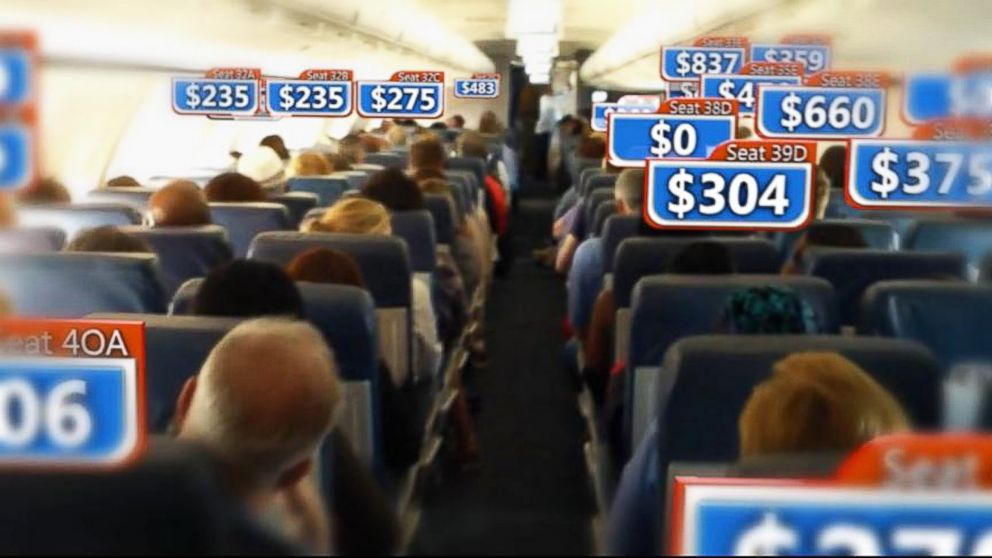
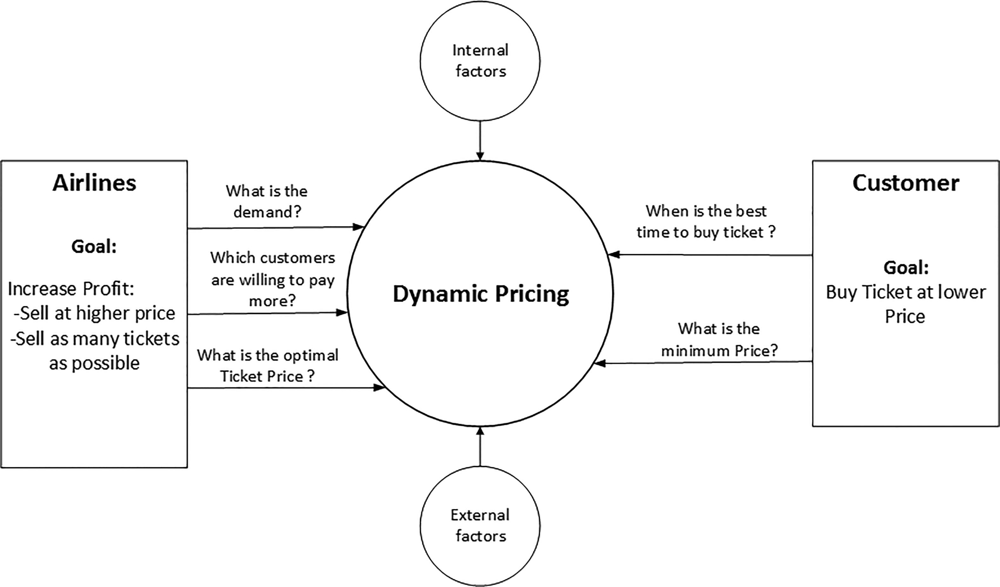

# Flight Price Predictor

  

  

## Table of Contents

* [What are you trying to do?](#what-are-you-trying-to-do)
* [How has this problem been solved before?](#how-has-this-problem-been-solved-before)
* [What is new about your approach?](#what-is-new-about-your-approach,-why-do-you-think-it-will-be-successful)
* [Who cares?](#who-cares-if-you're-successful,-what-will-the-impact-be)
* [How will you present your work?](#how-will-you-present-your-work)
* [What are your data sources?](#what-are-your-data-sources?-what-is-the-size-of-your-dataset,-and-what-is-your-storage-format)
* [What are potential problems with your capstone?](#what-are-potential-problems-with-your-capstone)
* [What is the next thing you need to work on?](#what-is-the-next-thing-you-need-to-work-on)

### What are you trying to do?
There are a lot of myths, suggestions, apps, and recommendations regarding when is the “best time” to purchase an airline ticket.  Ultimate, the best time to buy any airline ticket is when you need it, period.  However, we all like to save money and feel empowered by informed decisions.  My project aims to provide that empowerment.  I will create an airline prediction machine learning model for predicting domestic flight prices.  There are currently several websites that have incorporated a prediction to go along with the price of flights.  The main ones have been Kayak, Hopper, and Googleflights. Ultimately, I will use those app to measure the performance of my model.  The real-world impact my model could have, would be to test the accuracy of current models on the market, and test if the airline algorithms have begun to fluctuate to a degree that have rendered current models less accurate. Along with that, I would like to put some of the airline myths to the test and see if any data supports their claims.  For example, the myth that Tuesday is the cheapest day of the week to purchase tickets, or that the earlier you book tickets the more money you safe.   

### How has this problem been solved before?
Forecasting airline ticket prices had been done before, both by major travel companies, as well as startups.  However, given the uncertainty that any forecast model inherently faces, it does leave room for more people to try to put their accuracy to the test.  Many articles have been written regarding airline ticket pricing, the most recent and interesting one I have read has been, “Airline ticket price and demand prediction: A survey” from the Journal of King Saud University (https://www.sciencedirect.com/science/article/pii/S131915781830884X). The main takeaway was their suggestion to utilize social media data for future models.

  

  

### What is new about your approach, why do you think it will be successful?
Their approach was global, something far beyond a weeklong project.  The websites and apps also focus their models and attention to a global scale.  I do not intend to go that broad with my analysis.  Though I would like to compare my EDA findings to the global statistical insights from the research papers.  I do want to maximize the predictive power to a national scale.  I would like to incorporate some ARIMA, SARIMA models initially, gauge their performance against other models from other research papers from 2017 or before.  I believe my approach can be successful, given the constant evolution in dynamic pricing from the airline industry.     

### Who cares? If you're successful, what will the impact be?
Though the airlines tend to make most of their revenue from premium seats, such as business and first-class tickets.  The fact of the matter is, there are far more price sensitive consumers that are definitely aiming to find the best price for their next purchase.  A strong case can be made for the statement, not all economy passengers have flown first-class, but all first-class passengers have flown economy.   

### How will you present your work?
The ultimate goal would be with a running flask app to display the capabilities of my model.  It will take user input for a domestic destination and provide a probability of the price either going up or down in the near future.  I will try to use an API or web scrape to bring in other potential probabilities from Kayak and Skyscanner, two of the leading apps in this particular field.  

### What are your data sources? What is the size of your dataset, and what is your storage format?
There will multiple sources of data.  

### What are potential problems with your capstone?
More importantly, what is your plan to mitigate these problems? Again, being aware of previous solutions to similar problems gives you a template for successfully working with data of this type.

### What is the next thing you need to work on?
Getting the data, not just some, likely all? Understanding the data? Building a minimum viable product? Gauging how much signal might be in the data?